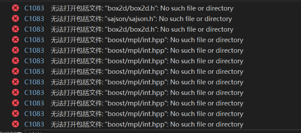
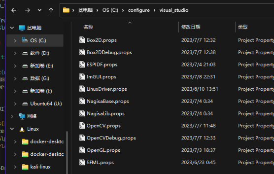
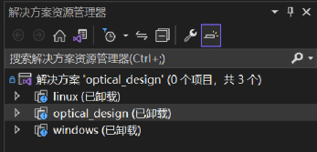
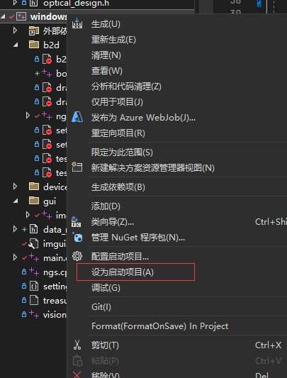
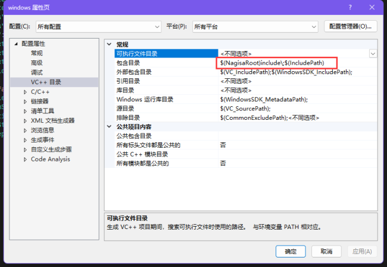
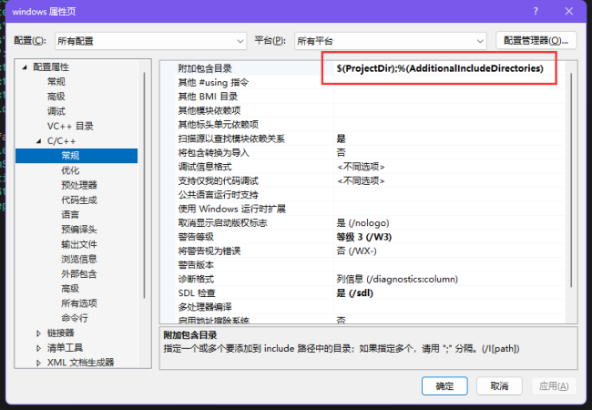

# optical_design
## 项目依赖
    NGS     ->  (请设置`NAGISA_DIR`环境变量，该环境变量指向NGS工程的include目录，如"G:\Projects\C_CPP\Clion\NGS\include\")  
    opencv  |  
    imgui   |  
    sajson  |-> (请设置`NAGISA_ROOT`环境变量，该变量指向root文件夹，如"G:\root\"，root内容请在群中下载压缩包(体积有点大))  
    box2d   |  
## 属性表设置:  
属性表可以很方便配置visual studio工程项目，但缺点是只能使用绝对路径  
所以这里将其设置为路径"C:\configure\visual_studio"，请将压缩包configure解压至该路径  

## 项目介绍：  

赛题可见"赛题.pdf"  
本项目为跨平台项目，在windows/linux上进行调试，最后在开发板上运行  
optical_design  :   项目本体(header-only),无需经过编译  
windows         :   windows运行环境  
linux           :   linux运行环境  

## 参考的工程结构：

    xxx:/project/c_cpp/
                    |---NGS/
                    |---optical_design/
    
    xxx:/root/ <- root.zip 解压至此(root.zip内可能只有include文件夹，此时替换掉include即可)
    
    c:/configure/visual_studio/  <- configure.zip解压至此
    
## 详细流程：  
1. 到 https://github.com/situNagisa/NGS 下载NGS工程  
2. 到 https://github.com/situNagisa/optical_design 下载optical_design项目工程  

3. 将NGS/include配置为环境变量`NAGISA_DIR`  
4. 解压root.zip，并设置其为环境变量`NAGISA_ROOT`  

  

    注意：结尾必须有个“\”号
#### 若环境变量配置失败则会出现以下问题：


5. 解压configure.zip至C:\configure\visual_studio\  
  

    注意：若属性表配置失败则会出现以下问题，这时请检查环境变量`NAGISA_ROOT`是否配置成功  
  

6. 设置启动项目为windows,尝试启动项目:  



## c/c++ vs知识补充
从c/c++源码到可执行文件(windows:.exe)需要经历`编译` `链接`过程  
### 编译
编写代码的过程中经常需要包含头文件
```cpp
#include <iostream>
#include <concepts>
#include "NGS/NGS.h"
...
```
要到哪里去找这些头文件呢
 - visual studio:   
  
  
其中,`vc++目录`和`c/c++ -> 常规` 分别对应了`#include`的`尖括号`和`引号`的优先查找目录  
前面我们有设置属性表,其作用就是根据系统已有的环境变量,设置`vc++目录`和`c/c++ -> 常规`查找路径
- gcc  
gcc一般用的是控制台,用选项`-I`指定`引号`的优先查找目录,`尖括号`的优先查找目录在linux环境下为/root/include/(windows不清楚)

## 日志
[2023:07:11]    工程刚合并，有些bug，尽量在今天赶出来  


